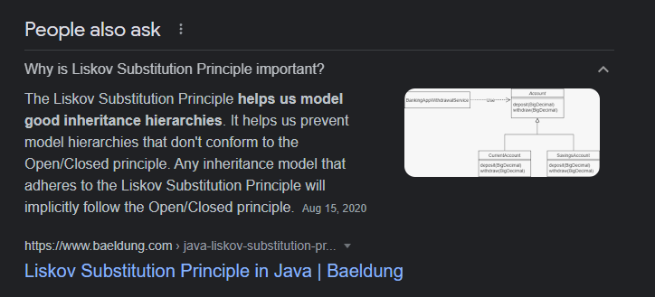
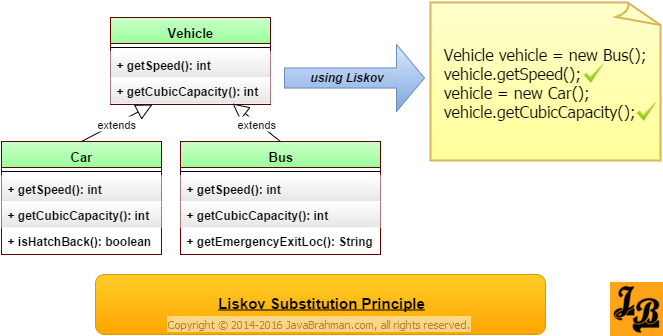

# Liskov Subtitution

## Overview

| Poin-poin penting                                                                                                                       |
| --------------------------------------------------------------------------------------------------------------------------------------- |
| Berkaitan dengan `Class Hierarchy`                                                                                                      |
| Setiap SubClass harus mengikuti Kontrak dari Parent class                                                                               |
| Ini Sangat Berkaitan Erat dengan Prinsip Open Close                                                                                     |
| Ketika sebuah kode tidak melanggar Liskov, maka pasti juga tidak melanggar Open Close                                                   |
| misal di Kontrak outputnya String. ini malah ngeluarin Int                                                                              |
| misal di Kontrak outputnya String aja. ini malah ada [Side Effects](https://medium.com/@igorwojda/5-kinds-of-side-effects-a67f6b495af9) |

## Good Inheritance Hierarchy





## Reference

[Github](https://github.com/heykarimoff/solid.python/blob/master/3.lsp.py), [Java](https://www.javabrahman.com/programming-principles/liskov-substitution-principal-java-example/), [Refactoring](https://reflectoring.io/lsp-explained/), [Anbidev](https://www.anbidev.com/prinsip-solid/)

## Contoh 1

=== ":octicons-circle-slash-16: Bad"

    _Contoh_:

    ````python linenums="1"
    class Person:
        def __init__(self, position):
            self.position = position

        def walk_north(self, dist):
            self.position[1] += dist

        def walk_south(self, dist):
            self.position[0] += dist


    class Prisoner(Person):
        PRISON_LOCATION = [3, 3]

        def __init__(self):
            self.position = self.PRISON_LOCATION
            self.is_free = False


    def process_person(person: Person):
        person.walk_north()


    def client_code():
        pemuda = Person()
        process_person(pemuda)

        penjahat = Prisoner()
        process_person(penjahat) # (1)
    ````

    1. Akan Error

=== ":octicons-check-circle-fill-16: Good"

    Yah, karena memang gak nyambung, yaudah tidak usah dibuat Hirarki Class nya

    ```python
    class FreeMan():

        def __init__(self, position):
            self.position = position

        def walk_north(self, dist):
            self.position[1] += dist

        def walk_south(self, dist):
            self.position[0] += dist


    class Prisoner():  # Prisoner can't walk
        PRISON_LOCATION = (3, 3)

        def __init__(self):
            self.position = self.PRISON_LOCATION


    ## Deprecated
    def process_person(person: Person): # (1)
        person.walk_north()


    def client_code():
        pemuda = FreeMan()
        pemuda.walk_north()

        penjahat = Prisoner()
    ```

    1. Dikomen aja, karena gak bisa Generic function-nya