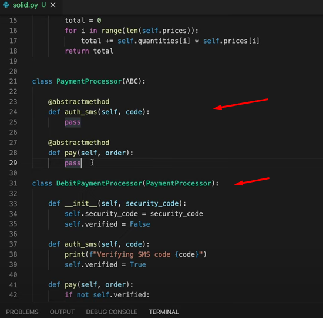
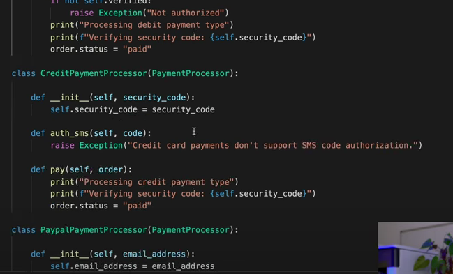
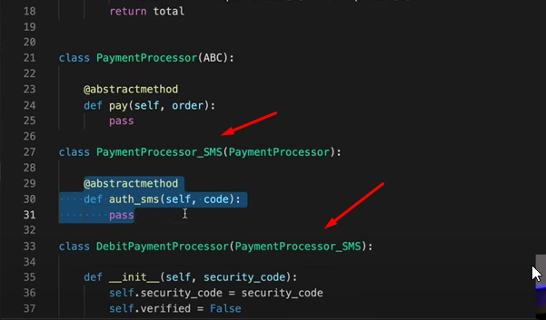

# Abstract / Interface / PArent Class / Super Class Segregation

## Overview

| Poin-poin penting                                                        |
| ------------------------------------------------------------------------ |
| Dalam bahasa Inggris segregation memiliki arti keeping things separated. |
| Lagi lagi terkait dengan masalah `Class Hierarchy`                       |
| Kalau ada method                       |

## Reference

[Youtube](https://www.youtube.com/watch?v=pTB30aXS77U)

### Before

### After

