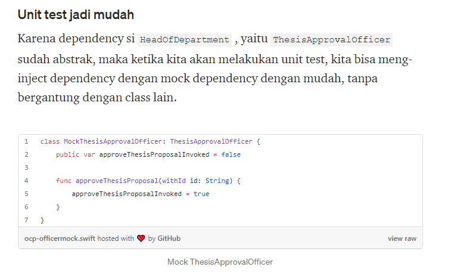
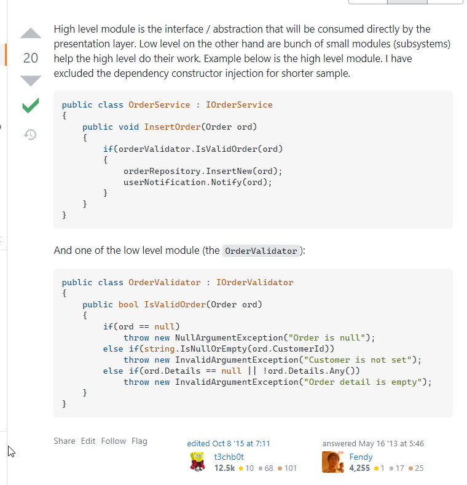
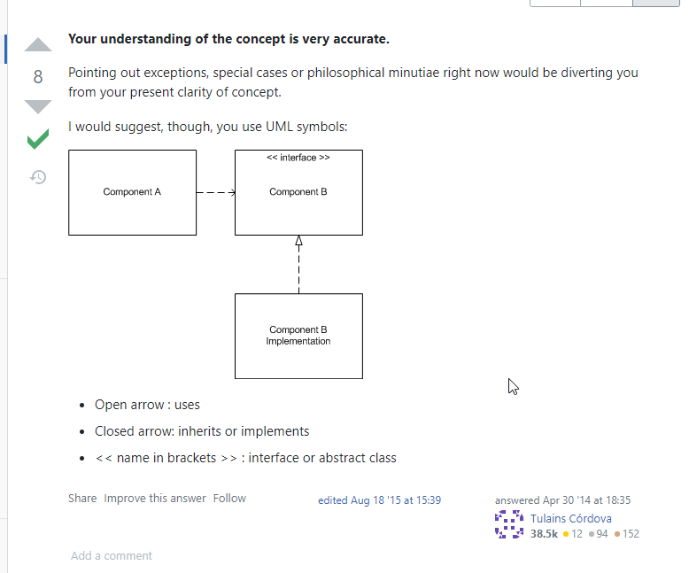

## Apa itu Solid ?

### Overview

SOLID Principles ini dicetuskan oleh Uncle Bob di sekitar tahun 1995-an, yang mana ketika kita mengimplementasikannya dalam pengembangan software dengan pendakatan berbasis objek (object oriented), diharapkan akan membuat kode program menjadi lebih adaptif terhadap perubahan serta mudah dalam maintenance.

S.O.L.I.D merupakan prinsip-prinsip yang dibuat untuk membantu programmer yang menggunakan bahasa pemograman berbasis OOP, membuat kodingan yang bersih, kokoh, dan mudah maintain. [[1]](http://himti.budiluhur.ac.id/apa-itu-prinsip-s-o-l-i-d/)

| Info         | Catatan                           |
| ------------ | --------------------------------- |
| Ide dari     | Uncle Bob                         |
| 1995         | 26 Tahun !!                       |
| Intended for | Object Oriented Programming (OOP) |
| Pros         | Maintainable                      |

### Prinsip dalam Solid

| Singkatan | Biar Hafal    | Bahasa Indo                                                              |
| --------- | ------------- | ------------------------------------------------------------------------ |
| S         | Single        | Satu kerjaan                                                             |
| O         | Open x Closed | Open di-extend, tapi Close di modif                                      |
| L         | Liskov        | Setiap SubClass harus mengikuti Kontrak dari Parent class nya            |
| I         | Interface     | Metode Parent Class harus terpakai semua sama SubClass                   |
| D         | Dependency    | High Level Module tidak boleh pakai SubClass, tapi pakainya Parent Class |

### Unit Test

[Medium.com](https://medium.com/99ridho/konsep-solid-principle-open-closed-principle-23adb282f4a5)

## Contoh OOP Solid

https://stackoverflow.com/questions/16558256/what-is-high-level-modules-and-low-level-modules

[Stack Overflow 2014](https://softwareengineering.stackexchange.com/questions/235025/dependency-inversion-principle-understanding-how-both-low-level-components-and)
