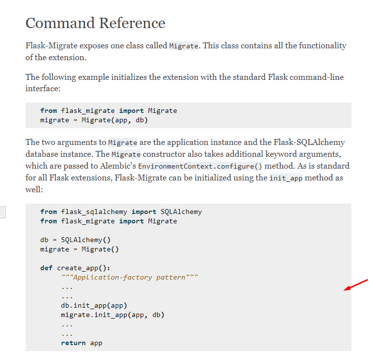

### Install

- Flask-Migrate

### Modify

``` python linenums="1" hl_lines="6 17"
import os

from flask import Flask
from flask_bcrypt import Bcrypt
from flask_sqlalchemy import SQLAlchemy
from flask_migrate import Migrate # (1)
from flask_cors import CORS

app = Flask(__name__)
CORS(app)

app_settings = os.getenv("APP_SETTINGS", "app.config.DevelopmentConfig")
app.config.from_object(app_settings)

bcrypt = Bcrypt(app)
db = SQLAlchemy(app)
migrate = Migrate(app, db)  # (2)


@app.route("/")
@app.route("/index")
def index():
    return "Hello, World!"


from app.api.auth import auth_blueprint

app.register_blueprint(auth_blueprint)

```

1.  :man_raising_hand: I'm a code annotation! I can contain `code`, __formatted
    text__, images, ... basically anything that can be expressed in Markdown.
2.  I'm a code annotation! I can contain `code`, __formatted
    text__, images, ... basically anything that can be expressed in Markdown.


### Kalau ada Error

```
https://stackoverflow.com/questions/67654302/flask-migrate-please-edit-configuratio-connection-logging-settings-on-flask
```

langsung flask db upgrade


### Kombinasi


```shell
$env:FLASK_APP = "app"
```


```shell
flask db init
```

akan membuat folder `migration`


https://flask-migrate.readthedocs.io/en/latest/#why-use-flask-migrate-vs-alembic-directly

https://stackoverflow.com/a/30999575/2362966

```shell
flask db migrate
```

akan membuat alembic_version

```shell
flask db upgrade
```

akan membuat tabel user


## Application Factory Pattern

